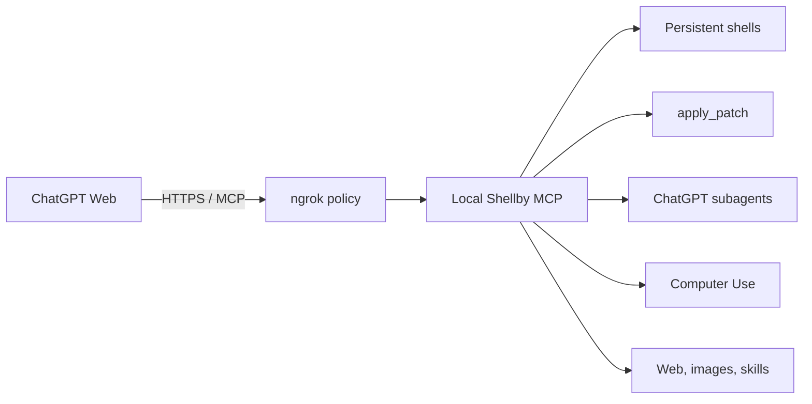

<h1 align="center">Shellby MCP</h1>

<p align="center">
  <strong>A local coding harness that gives ChatGPT Web persistent shells, direct file editing, Computer Use, and browser-backed subagents.</strong>
</p>

<p align="center">
  <a href="https://github.com/Serbyte-Development/shellby-mcp/actions/workflows/ci.yml"></a>
  <a href="LICENSE"></a>
  
</p>

<p align="center">
  <a href="#quick-start">Quick start</a> ·
  <a href="#how-it-works">How it works</a> ·
  <a href="#security-model">Security</a> ·
  <a href="wiki/">Maintainer wiki</a>
</p>

> [!CAUTION]
> Shellby MCP deliberately gives an authorized ChatGPT caller the authority of your local macOS user. It can run commands, edit files, and control supported applications. It is not a sandbox and is intended for experienced software engineers.

Shellby MCP connects ChatGPT Web to a stateful local runtime over MCP. MCP requests remain stateless at the HTTP boundary, while shells, browser conversations, webpage documents, Computer Use targets, and skills persist in the local process.

## What you get

| Capability        | What it provides                                                                                       |
| ----------------- | ------------------------------------------------------------------------------------------------------ |
| Persistent shells | Named login shells retain cwd, exported environment, processes, and command history across MCP calls.  |
| Direct editing    | Native ChatGPT `apply_patch` binary edits files independently of shell state.                          |
| Browser subagents | Up to three detached ChatGPT Web conversations with follow-up context and concurrent result retrieval. |
| Computer Use      | Native macOS observation and interaction tools from [Peekaboo](https://peekaboo.sh/).                  |
| Web and images    | Rendered webpage extraction, bounded document pagination, and native image transport.                  |
| Dynamic skills    | Workspace skills load directly from `<workspace>/skills/*/SKILL.md`.                                   |


## Requirements

- macOS on Apple Silicon or Intel
- Node.js 22.13.0 or newer
- npm
- An [ngrok](https://ngrok.com/) account and CLI
- A ChatGPT account where Developer Mode/custom MCP apps are available

Google Chrome is optional for browser-backed subagents. Shellby includes a Universal 2 Peekaboo binary; its macOS permissions are required only when Computer Use tools are called.

## Quick start

1. Install ngrok and clone the repository:

   ```bash
   brew install --cask ngrok
   git clone https://github.com/Serbyte-Development/shellby-mcp.git
   cd shellby-mcp
   npm ci
   ```

2. Authenticate ngrok once:

   ```bash
   ngrok config add-authtoken <your-token>
   ```

   > [!NOTE]
   > If you don't have an ngrok authtoken, you can get one for free [here](https://dashboard.ngrok.com/get-started/your-authtoken).

3. Check the machine and run guided setup:

   ```bash
   npm run setup
   ```

   Setup prepares the workspace, builds the server, checks optional Peekaboo permissions, and creates a dedicated Chrome profile when Chrome is installed. Sign into ChatGPT once in the dedicated window if it opens.

   > [!IMPORTANT]
   > Run initial setup and the first `npm start` from Terminal.app. PM2 keeps a per-user background daemon, and macOS may attribute Peekaboo's Screen Recording and Accessibility access to the GUI application that first launched that daemon. If Claude, Codex, Cursor, or another app launches PM2 first, macOS may require permissions for that app instead. Starting Shellby again from Terminal does not replace an existing PM2 daemon.

4. Start everything:

   ```bash
   npm start
   ```

   Startup builds the server, starts or reloads the local MCP and ngrok through the repository's PM2 dependency, launches the configured ChatGPT browser, waits for `/healthz`, and prints the public MCP URL.

5. In ChatGPT Developer Mode, create a custom app using the printed `https://…/mcp` URL and select no authentication.

> [!IMPORTANT]
> The first trusted remote `tools/call` binds this installation to that ChatGPT subject. Later remote tool calls must come from the same subject. Use `npm run auth:reset` to intentionally clear the binding.

## How it works



- Production HTTP listens only on `127.0.0.1:3333`.
- The checked-in ngrok policy accepts ChatGPT-origin traffic on the exact `/mcp` route and marks it as remote.
- Remote calls are subject-bound; direct localhost MCP clients are intentionally unauthenticated.
- Runtime state stays local. Remote ownership is stored at `~/.shellby/auth.json` with owner-only permissions.

The local development endpoint is `http://127.0.0.1:3333/mcp`.

## Optional capabilities

<details>
<summary><strong>Browser-backed ChatGPT subagents</strong></summary>

```bash
npm run setup:chatgpt
npm run chatgpt
```

The setup command creates a dedicated Chrome profile under `~/.shellby/chatgpt-chrome`. The runtime attaches over CDP at `127.0.0.1:9222`; it never copies or modifies your normal Chrome profile. Managed subagent tabs are created as unfocused background targets.

Reuse an `agent_id` to continue the same in-process conversation. A new ID starts a new conversation. See [Browser ChatGPT Subagents](wiki/pages/Browser%20ChatGPT%20Subagents.md).

</details>

<details>
<summary><strong>Computer Use with Peekaboo</strong></summary>

```bash
npm run setup:computer
npm run setup:computer -- --status
```

For predictable macOS permission ownership, run the initial `npm run setup`, `npm start`, and permission setup from Terminal.app, then grant Terminal when macOS requests access. Peekaboo may route through its Bridge daemon; the status command reports both the selected source and local runtime, and every required source should show `Granted`.

If PM2 was first started by another GUI application and you intentionally want Terminal to become the launch context, run `./node_modules/.bin/pm2 kill` from Terminal before starting Shellby again. This stops every application managed by that user's PM2 daemon, not only Shellby.

Shellby starts its checked-in Peekaboo binary as a restricted child MCP and publishes ten native schemas under clear `computer_*` names with concise model-facing descriptions. `computer_see` is visual-first: it returns a same-dimension JPEG plus a compact snapshot/coordinate receipt, while `computer_inspect_ui` exposes the bounded accessibility tree only when requested. Argument structure, validation, and execution remain upstream. Screen Recording enables observation; Accessibility and Event Synthesizing enable actions. Computer actions are stateful and are never automatically retried by Shellby.

</details>

## Security model

> [!WARNING]
> The configured workspace is a starting directory and agent convention, not a filesystem boundary. Shells, patches, webpage fetching, browser delegation, and Computer Use retain the permissions of the current macOS user.

- Local MCP access is intentionally unauthenticated. Do not expose port 3333 through an untrusted proxy.
- The authenticated Chrome profile is part of the trust boundary for `subagent_run`.
- `agent-commands.yaml` is gitignored and permission-restricted, but it may contain sensitive tool inputs. Treat it as private.
- Review [SECURITY.md](SECURITY.md) before deployment and report vulnerabilities privately.

## Operations

| Command             | Purpose                                                               |
| ------------------- | --------------------------------------------------------------------- |
| `npm start`         | Build and start/reload MCP, ngrok, and the configured ChatGPT browser |
| `npm run restart`   | Clear the current audit log, rebuild, and reload managed processes    |
| `npm run status`    | Show PM2 process state                                                |
| `npm run logs`      | Follow PM2 logs                                                       |
| `npm run print-url` | Print the active public `/mcp` URL                                    |
| `npm run stop`      | Stop the managed MCP and ngrok processes                              |

PM2 is a repository dependency; no global PM2 installation is required.

<details>
<summary><strong>Configuration</strong></summary>

Copy [.env.example](.env.example) to `.env`. The main inputs are:

| Variable                        | Default                     | Purpose                                              |
| ------------------------------- | --------------------------- | ---------------------------------------------------- |
| `MCP_CWD`                       | `~/Desktop/agent-workspace` | Initial workspace and `AGENTS.md` root               |
| `MCP_SHELL`                     | `/bin/zsh`                  | Persistent login shell executable                    |
| `MCP_CHATGPT_CDP_ENDPOINT`      | `http://127.0.0.1:9222`     | Existing Chrome CDP endpoint                         |
| `MCP_CHATGPT_PROJECT_URL`       | unset                       | Optional ChatGPT Project start URL                   |
| `MCP_CHATGPT_PROFILE_DIRECTORY` | unset                       | Optional profile within dedicated Chrome data        |
| `NGROK_URL`                     | unset                       | Optional fixed ngrok domain                          |
| `NGROK_BIN`                     | `ngrok`                     | Optional ngrok executable override                   |
| `NGROK_AUTHTOKEN`               | unset                       | Optional token when ngrok is not globally configured |
| `CHROME_BIN`                    | standard macOS path         | Optional Chrome executable override                  |

Host, port, output bounds, shell capacity, and lifecycle limits are fixed in [`src/config.ts`](src/config.ts).

</details>

<details>
<summary><strong>Development and validation</strong></summary>

```bash
npm run dev
npm run lint
npm run type-check
npm test
npm run build
```

Use `npm run inspect` for the MCP inspector and `npm run schemas` to print the exact published tool schemas. Real authenticated-browser tests are manual and excluded from CI; see [Build and Test](wiki/pages/Build%20and%20Test.md).

</details>

## Documentation

The [maintainer wiki](wiki/) is the detailed source of truth:

- [Project Overview](wiki/pages/Project%20Overview.md)
- [Architecture Map](wiki/pages/Architecture%20Map.md)
- [Configuration and Startup](wiki/pages/Configuration%20and%20Startup.md)
- [MCP Tool Surface](wiki/pages/MCP%20Tool%20Surface.md)
- [Build and Test](wiki/pages/Build%20and%20Test.md)
- [Open Questions and Risks](wiki/pages/Open%20Questions%20and%20Risks.md)

## Contributing

Contributions are welcome. Read [CONTRIBUTING.md](CONTRIBUTING.md), keep changes focused, and run the validation commands above before opening a pull request.

## License

[MIT](LICENSE). The vendored `apply_patch` binary retains its upstream OpenAI Codex license and notices under [`vendor/apply-patch/`](vendor/apply-patch/).

Developed and maintained by [Serbyte Development](https://www.serbyte.net/).
