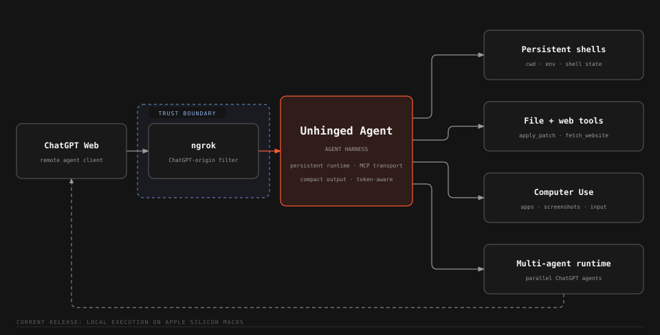

# Unhinged Agent - Coding Harness for ChatGPT Web

[](https://github.com/Serbyte-Development/unhinged-agent/actions/workflows/ci.yml)
[](LICENSE)

> [!WARNING]
> Made for Software Engineers. Not for non-technical users.
> Use at your own risk.

Unhinged Agent gives ChatGPT complete control of your computer. Persistent local shells, first-class file editing, webpage access, Computer Use, dynamic skills, and parallel browser-backed agents while keeping tool execution and runtime state on your computer.



> **Security:** Unhinged Agent deliberately gives an authorized ChatGPT caller the power of your local user account. It can execute commands, edit files, and control supported applications. Run it only on a computer you trust.

## Capabilities

- **Full computer access:** persistent shells, native `apply_patch`, webpage fetching, and focused Computer Use tools.
- **Persistent tools:** live named shells retain full process state across calls; hibernated shells retain only cwd and exported environment and transparently recreate when reused.
- **Multi-agent capabilities:** launch up to three independent browser-backed ChatGPT agents, continue named agent conversations, and retrieve results concurrently.
- **Context optimized:** compact model-facing Markdown, token-bounded output, pagination, schema compression, and retained local state reduce repeated context cost.
- **Extensible:** dynamic workspace skills load directly from `<workspace>/skills/*/SKILL.md`.
- **Agent-native runtime:** parallel shell batches, idempotent request IDs, and MCP tool-call auditing are designed around autonomous agent work.

MCP is only the transport layer. Unhinged Agent uses MCP TypeScript SDK v2 with stateless Streamable HTTP requests while keeping shared agent runtime state in the local process. Shells, browser agents, and adapters span independent requests; durable remote ownership survives restarts in `~/.unhinged-agent/auth.json`.

## Compatibility and requirements

- macOS on Apple Silicon (`arm64`) or Intel (`x86_64`) **for the current release**. Both architectures run the full CI validation suite. Broader host portability is planned; macOS is the current compatibility boundary.
- Node.js 22.13.0+
- npm
- An [ngrok](https://ngrok.com/) account and CLI
- ChatGPT Plus or higher, with access to Developer Mode/custom MCP apps.

Optional capabilities:

- Google Chrome for `subagent_run` and `subagent_result`
- [Peekaboo](https://peekaboo.sh/) for `computer_*` tools

Install Peekaboo if you want Computer Use:

```bash
brew install steipete/tap/peekaboo
```

`npm run setup` asks Peekaboo to report its own permission status. If a required permission is missing, run `npm run setup:computer`; that delegates directly to Peekaboo's built-in permission guide instead of duplicating macOS permission logic. The server still starts when Peekaboo or the dedicated ChatGPT browser are unavailable. Only the dependent tools fail.

## Quick start

Install ngrok if needed:

```bash
brew install --cask ngrok
```

Clone and install dependencies:

```bash
git clone https://github.com/Serbyte-Development/unhinged-agent.git
cd unhinged-agent
npm ci
```

Authenticate ngrok once using the token from your ngrok account:

```bash
ngrok config add-authtoken <your-token>
```

Verify the supported Mac, Node, local dependencies, and ngrok configuration:

```bash
npm run preflight
npm run setup
```

`preflight` only reports whether the runtime is ready. `setup` provides a guided terminal workflow that checks prerequisites, prepares the workspace, builds Unhinged Agent, asks an installed Peekaboo to report Computer Use permissions, and best-effort prepares the dedicated ChatGPT browser. Existing workspace instructions are never overwritten. Set `MCP_CWD` before setup to initialize a different workspace.

If Google Chrome is installed, `setup` also creates a separate profile under `~/.unhinged-agent/chatgpt-chrome` and opens ChatGPT. Sign into ChatGPT in that window once. The repository never copies or modifies your normal Chrome profile.

If browser setup was skipped because Chrome was unavailable or port `9222` was already in use, retry it later with:

```bash
npm run setup:chatgpt
```

## Start

After first-time setup, normal use is one command:

```bash
npm start
```

`npm start` validates the runtime, builds the MCP, starts or reloads the MCP and ngrok using the repository's local PM2 dependency, launches the dedicated ChatGPT Chrome profile when configured, waits for the local health check, and prints the exact public `/mcp` URL.

Example:

```text
ChatGPT browser: running
MCP server: running
ngrok: running
MCP URL: https://example.ngrok-free.app/mcp
```

ngrok assigns a public domain by default. If your ngrok account has a fixed/custom domain, pass it when starting:

```bash
NGROK_URL="your-domain.example" npm start
```

`NGROK_URL` is optional and is never repository-specific. `npm run print-url` prints the currently active ChatGPT-ready endpoint at any time.

## Add it to ChatGPT

Enable Developer Mode in ChatGPT, create a custom app, and use the URL printed by `npm start` as the MCP endpoint. This server uses no MCP OAuth, so choose the no-authentication option, scan the tools, and create the app.

The first trusted remote `tools/call` binds this installation to the calling ChatGPT subject. Later remote tool calls must carry the same subject. Discovery does not bind ownership.

Reset the bound ChatGPT owner with:

```bash
npm run auth:reset
```

## How it works

ChatGPT Web reaches the local Unhinged Agent harness through the included ngrok policy. The policy accepts ChatGPT-origin traffic on the exact `/mcp` route and marks it as remote; Unhinged Agent then binds the first remote tool caller's OpenAI subject and requires that same subject on later remote tool calls.

MCP carries tool discovery and tool calls. The actual agent state stays local: persistent shells, webpage cache, Computer Use adapters, skills, and browser-backed agents are shared across otherwise stateless MCP requests.

Direct local MCP clients can also connect to:

```text
http://127.0.0.1:3333/mcp
```

Local access is intentionally unauthenticated. Authentication state for the trusted remote ChatGPT path is stored outside the repository at `~/.unhinged-agent/auth.json`.

## Runtime commands

```bash
npm start
npm run restart
npm run status
npm run logs
npm run stop
npm run print-url
npm run chatgpt
```

PM2 is a repository dependency and implementation detail; users do not need to install it globally. `restart` also clears the current `agent-commands.yaml` audit log before reloading the runtime.

## Multi-agent capabilities

Unhinged Agent can use ChatGPT Web itself as a parallel agent runtime. `npm run setup:chatgpt` creates a dedicated Chrome profile and launches it with the Chrome DevTools Protocol on `127.0.0.1:9222`. After you sign into ChatGPT once, `npm start` launches that profile automatically when needed. `npm run chatgpt` launches it manually or brings the hidden managed browser to the foreground without restarting the MCP.

Setup keeps the dedicated Chrome visible so you can sign in. Normal `npm start` runs keep that same headed Chrome process hidden in the background. Creating a subagent tab can make Chrome visible on macOS, so the MCP immediately re-hides only the dedicated profile's Chrome process after page creation. Hiding is best effort: if macOS refuses it, Chrome simply stays visible and subagent behavior is unchanged.

Returned turn IDs are readable and sequential per agent, for example `seo-audit_turn_1` and `seo-audit_turn_2`. Local runtime state expires after 30 minutes without observable progress. Cleanup closes the managed tab, removes local turn records, and releases any generation slot while retaining the conversation reference in-process. Reusing the same `agent_id` then reopens the saved ChatGPT conversation; if that conversation was deleted, recovery fails explicitly instead of silently starting a new thread.

`subagent_run` accepts 1-3 independent agents per call. Reusing an `agent_id` retains that subagent's conversation context; a new ID creates a new conversation. The first task is submitted immediately, the second 5 seconds later, and the third 7 seconds after that; at most three generations may run at once. The passive ChatGPT network listener can recognize a definitive final response, complete the local turn, release its generation slot, and queue `agent_finished:<agent_id>:<turn_id>`. That event is appended to the next MCP tool response. `subagent_result` retrieves 1-3 turn results concurrently and remains the reconciliation fallback when a turn is still running. The actual subagent answer is returned only by `subagent_result`. See [`wiki/pages/Browser ChatGPT Subagents.md`](wiki/pages/Browser%20ChatGPT%20Subagents.md) for the full architecture and code map.

Normal non-Computer tools default to compact model-facing Markdown. `MCP_TOOL_OUTPUT_STRUCTURED=always|optional|never` controls the result surface: `always` preserves advertised output schemas and structured results, `optional` is the default and adds `structured: false` to tool inputs so callers may request a structured result per call, and `never` exposes compact content only. Computer Use tools and `image_view` keep their native content contracts. MCP audit entries log approximate tool-context cost as `in / out` token counts when the final model-facing output is available.

Default endpoint:

```text
http://127.0.0.1:9222
```

Override it with:

```bash
export MCP_CHATGPT_CDP_ENDPOINT="http://127.0.0.1:9222"
```

When a non-local CDP endpoint is configured, the startup helper leaves Chrome lifecycle to that external endpoint.

## Local development

For direct development without the managed production runtime:

```bash
npm run dev
```

The local endpoint is `http://127.0.0.1:3333/mcp`. `npm run inspect` opens the MCP inspector.

## Tools

Core tools:

- `fetch_website`
- `image_view`
- `skill_list`
- `skill_load`
- `subagent_run`
- `subagent_result`
- `apply_patch`

Shell tools:

- `shell_run`
- `shell_poll`
- `shell_reset`
- `shell_list`
- `shell_close`

Computer Use tools:

- `computer_list`
- `computer_observe`
- `computer_inspect`
- `computer_click`
- `computer_type`
- `computer_press`
- `computer_hotkey`
- `computer_scroll`
- `computer_drag`
- `computer_app`
- `computer_window`

For exact schemas, lifecycle behavior, output limits, and model-facing descriptions, see [MCP Tool Surface](wiki/pages/MCP%20Tool%20Surface.md).

## Persistent shells

`shell_id` defaults to `default`. While a shell is live, reusing the same ID preserves its full process state, including cwd, exported environment, functions, retained command records, and background processes. Live shells form a 16-slot LRU working set. A non-busy named shell may hibernate after 5 minutes idle or be pressure-evicted when capacity is needed; hibernation caches only cwd and exported environment for 24 hours since last use. Reusing that `shell_id` transparently creates a new process with those two pieces of state. Functions, aliases, transcripts/request records, and live/background processes are not restored. The protected `default` shell is not automatically evicted or explicitly closable.

When all live capacity is occupied by busy shells (plus any protected default slot), new shell creation fails instead of evicting active work. `shell_close` is destructive: it terminates a non-default live shell and discards any cached state for that ID. `shell_reset` likewise starts clean. `shell_poll` only works while the original live shell and its request records still exist.

Each new `shell_run` command requires a `request_id`. Retrying the same request ID with the same command returns the retained result rather than executing it twice. Reusing the ID with different command text returns a conflict.

Independent commands can share one `shell_run` call:

```text
*** Run:
npm run lint
*** Run:
npm run type-check
*** Run: ./packages/api
npm test
*** Run: ../../shared
npm run check
*** Run: /tmp
pwd
```

Starting `command` with `*** Run:` selects batch mode and no outer begin/end envelope is needed. A bare `*** Run:` uses the batch cwd. Add a path only when that command needs a different working directory. Relative paths resolve from the batch cwd, and absolute paths such as `/tmp` are used directly. The batch cwd is the call's `cwd` when provided, otherwise the current persistent-shell directory. Each shell runs at most four batch children concurrently and queues extras. Each child keeps separate bounded output; nonzero exits do not cancel siblings. Batch children time out after 30 minutes. `shell_poll` continues the same outer `shell_id` and `request_id`; finished children appear in the shared paged output as blocks labeled with run number, path, status or exit code, and any permanently dropped bytes.

Defaults:

- 8 live shells including `default`
- 5-minute idle hibernation for non-default named shells
- 24-hour cached cwd/exported-environment lifetime since last use
- 1,024-token response output (`o200k_base`)
- 16,384-token maximum response override
- 256 KiB retained output per command
- 1 MiB rolling shell transcript
- 4 concurrent parallel child commands per shell
- 30-minute timeout per parallel child

The workspace defaults to:

```text
~/Desktop/agent-workspace
```

This is a default working directory and model convention, not a sandbox.

## Computer Use

Run Peekaboo's permission guide with:

```bash
npm run setup:computer
```

During normal first-time setup, Unhinged Agent runs `peekaboo permissions status --all-sources` when Peekaboo is installed. `setup:computer` delegates to `peekaboo permissions grant`, which provides Peekaboo's current macOS permission instructions.

`computer_observe` returns a screenshot plus snapshot ID. Snapshot-based actions use that retained capture target so coordinates are interpreted against the correct screen/window. Observe again after the UI changes rather than reusing stale coordinates.

## Image viewing

`image_view` accepts one local image path and returns a native MCP image block plus compact `filename — dimensions — size` text. Relative paths resolve from the configured workspace. Images are JPEG-encoded through the same shared transport helper used by `computer_observe`; dimensions are never resized, quality is reduced only when necessary to keep the MCP response under the 4 MiB transport budget, and images that still cannot fit fail explicitly rather than being resized.

## `apply_patch`

The repository includes a pinned macOS Universal 2 standalone `apply_patch` executable at `vendor/apply-patch/apply_patch`, containing both arm64 and x86_64 slices. macOS selects the native slice automatically. The MCP executes that vendored binary directly as a first-class tool; it is not installed into or exposed through the workspace shell.

Each call requires an absolute `cwd` and a normal Codex-style patch. It runs independently of shell state and has abort escalation. Failure diagnostics are capped internally at 1,024 `o200k_base` tokens so patch errors cannot consume unbounded model context.

## Configuration

Copy `.env.example` to `.env` to override the defaults below. Internal safety limits stay in `src/config.ts` and are intentionally not exposed as environment variables.

| Variable                    | Default                     | Purpose                                            |
| --------------------------- | --------------------------- | -------------------------------------------------- |
| `NGROK_URL`                 | unset                       | Optional fixed ngrok domain used by tunnel helpers |
| `NGROK_BIN`                 | `ngrok` from `PATH`         | Optional ngrok executable override                 |
| `NGROK_AUTHTOKEN`           | unset                       | Optional ngrok auth token                          |
| `MCP_SHELL`                 | `/bin/zsh`                  | Persistent shell executable                        |
| `MCP_CWD`                   | `~/Desktop/agent-workspace` | Initial/default workspace                          |
| `MCP_PEEKABOO_BIN`          | `peekaboo`                  | Peekaboo executable                                |
| `MCP_CHATGPT_CDP_ENDPOINT`  | `http://127.0.0.1:9222`     | Chrome CDP endpoint for browser subagents          |
| `MCP_CHATGPT_PROJECT_URL`   | unset                       | Optional project start URL; unset uses normal ChatGPT |
| `CHROME_BIN`                | normal macOS Chrome path    | Optional dedicated Chrome executable override      |
| `MCP_DEFAULT_OUTPUT_TOKENS` | `1024`                      | Default `max_output_tokens` when omitted           |
| `MCP_MAX_OUTPUT_TOKENS`     | `16384`                     | Largest allowed `max_output_tokens` override       |
| `MCP_MAX_SHELLS`            | `8`                         | Maximum live shells including `default`            |
| `MCP_SHELL_IDLE_TTL_MS`     | `300000`                    | Idle hibernation; `0` disables idle hibernation    |
| `MCP_SHELL_CACHE_TTL_MS`    | `86400000`                  | Hibernated cwd/environment lifetime since last use |

The production listener always binds to `127.0.0.1:3333`; host and port are not environment-configurable. Tests may still inject a different host or request an ephemeral port directly through the HTTP server API.

## Development

Validation:

```bash
npm ci
npm run lint
npm run type-check
npm test
npm run build
```

The real ChatGPT browser contract has two separate manual-only compatibility tests. Both are intentionally excluded from `npm test` and CI. The read-only fixture test reopens permanent saved normal and project conversations, captures their current conversation JSON from Chrome's network stream, and verifies them against frozen sanitized copies without generating a new turn:

```bash
npm run chatgpt
npm run test:live:fixture
```

The generative canary exercises the lifecycle that a saved fixture cannot cover. It consumes one real ChatGPT subagent conversation, so make sure no other subagent generation is active before running:

```bash
npm run chatgpt
npm run test:live:subagent
```

`test:live:fixture` never submits a prompt. It runs the same endpoint, reload, parser, exact `content.parts` Markdown, and rendered DOM contract against `test/fixtures/chatgpt-live-fixture/conversation.json` and `test/fixtures/chatgpt-project-live-fixture/conversation.json`. The project fixture is skipped until that second frozen file exists; its conversation ID is read directly from the frozen payload. `test:live:subagent` is a black-box MCP canary: it starts the normal MCP server, uses only public `subagent_run`/`subagent_result` calls, and reuses one `agent_id` for two sequential generated turns. It does not inspect module internals, tracker state, DOM, Page objects, or conversation IDs. Turn 2 proves persistent context by recalling a random key supplied only in Turn 1. Sanitized evidence from the most recent generative run is written under ignored `test/live/artifacts/`.

Format code with:

```bash
npm run format
```

Print the exact MCP tool schemas advertised by the server:

```bash
npm run schemas
npm run schemas -- shell_run fetch_website
```

The wiki under [`wiki/`](wiki/) is the concise source of truth for maintainers. Current code and tests outrank historical raw notes and README text when they disagree.

## Contributing and security

Contributions are welcome; see [CONTRIBUTING.md](CONTRIBUTING.md). For vulnerabilities, use the private reporting guidance in [SECURITY.md](SECURITY.md) rather than opening a public issue.

## License

[MIT](LICENSE). The vendored `apply_patch` binary retains its upstream OpenAI Codex license and notices under [`vendor/apply-patch/`](vendor/apply-patch/).

Developed & maintained by [Serbyte Development](https://www.serbyte.net/).
